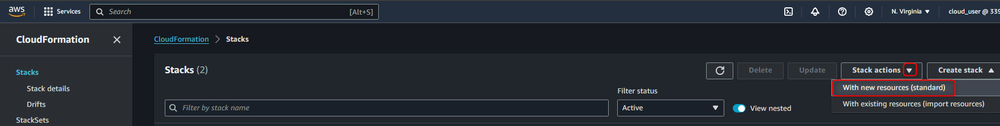
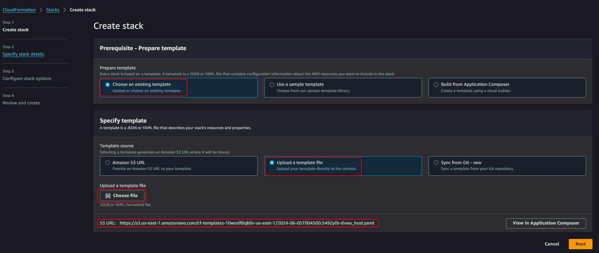
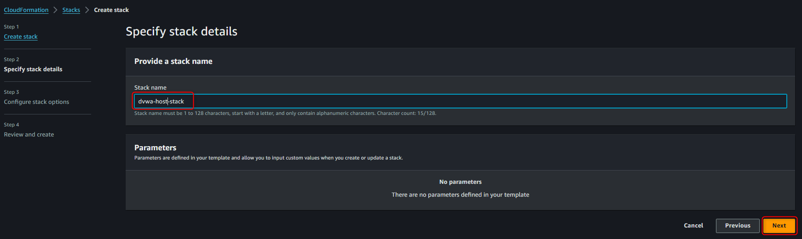
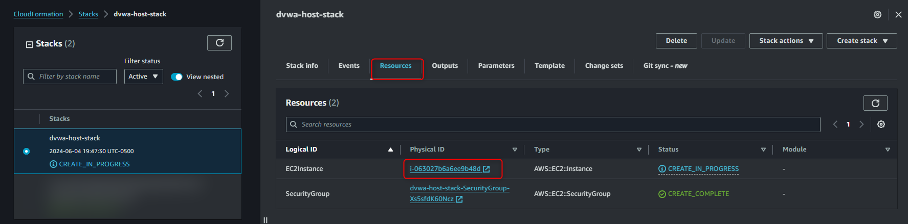
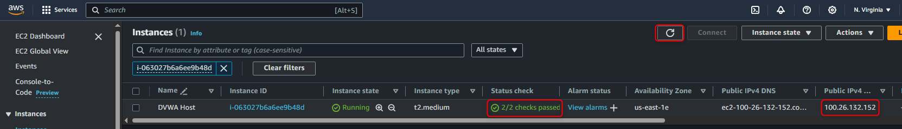
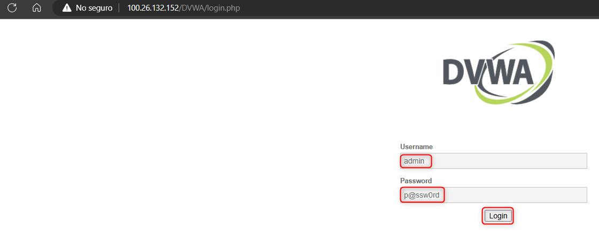
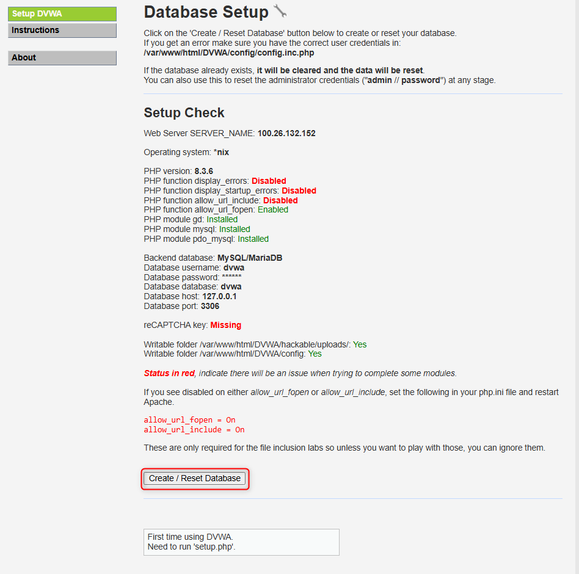
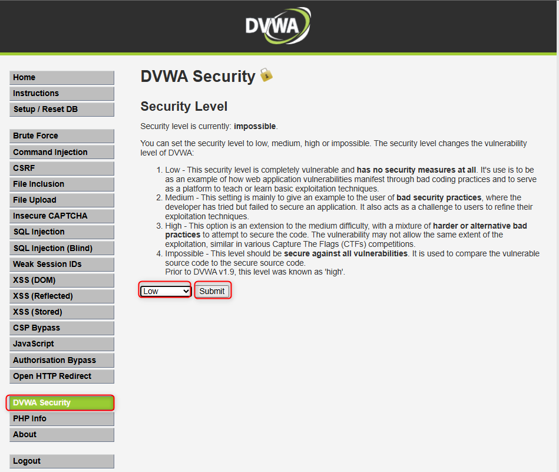

# DVWA Lab

## **Introduction**

### **Overview**

Damn Vulnerable Web Application (DVWA) is a PHP/MySQL web application that is intentionally designed to be vulnerable. It provides a safe environment for security professionals and enthusiasts to practice their skills and test various attack techniques. This documentation will guide you through the process of deploying an Amazon EC2 instance with DVWA using AWS CloudFormation.

### **Objective**

The objective of this document is to provide a step-by-step guide for deploying an EC2 instance with DVWA using a CloudFormation template. By following this guide, you will be able to set up an environment that can be used for security testing and vulnerability assessments.

### **Prerequisites**

Before you begin, ensure you have the following:

- An active AWS account.
- Basic knowledge of AWS services, particularly EC2 and CloudFormation.
- Familiarity with basic security testing concepts.

## **Environment Setup**

### **Step 1: Download the Deployment File**

First, download the deployment file by visiting the following URL: [dvwa_host.yaml](https://github.com/Oscarce10/sec-labs/DVWA-host/blob/master/dvwa_host.yaml). This file contains the infrastructure as code (IaC) necessary for deploying the DVWA application on an EC2 instance.

### **Step 2: Access the AWS Console**

Go to the AWS Management Console. You can log in using your AWS account credentials.

### **Step 3: Navigate to CloudFormation**

In the AWS Management Console, navigate to **CloudFormation** by selecting it from the services menu or searching for it in the search bar.

### **Step 4: Create a New Stack**

- Click on **Stacks** in the CloudFormation dashboard.
- Click on **Create stack** and then select **With new resources (standard)**.

### **Step 5: Prepare the Template**

- Under **Prerequisite - Prepare template**, click on **Choose an existing template**.

### **Step 6: Upload the Template File**

- In the **Specify template** section, select **Upload a template file**.
- Click on **Choose file** and upload the previously downloaded **`dvwa_host.yaml`** file.

### **Step 7: Proceed to the Next Steps**

- Click **Next**.

### **Step 8: Provide a Stack Name**

- In the **Stack name** field, provide a name for your stack (e.g., **`DVWA-Deployment`**).

### **Step 9: Proceed Further**

- Click **Next**.

### **Step 10: Configure Stack Options**

- Click **Next** again to skip additional configuration options.

### **Step 11: Submit the Stack**

- Review the stack settings and click **Submit** to create the stack.

### **Step 12: Monitor Resource Creation**

- In the **Resources** tab of the stack details, you will see the resources being created, including the security group and the EC2 instance. Click on the **Instance ID** to view details of the instance.

### **Step 13: Check the Instance Status**

- Refresh the instance status until the **Status check** shows **2/2 checks passed**.

### **Step 14: Copy the IPv4 Address**

- Copy the IPv4 address of the instance.

### **Step 15: Access DVWA**

- Open a web browser and navigate to **`http://<IPv4>/DVWA`**, replacing **`<IPv4>`** with the copied IPv4 address.

### **Step 16: Log In to DVWA**

- Use the following credentials to log in:
    - **Username:** **`admin`**
    - **Password:** **`p@ssw0rd`** or **`password`**

### **Step 17: Create/Reset Database**

- If prompted, click on **Create / Reset database**.

### **Step 18: Re-authenticate**

- After creating or resetting the database, the session will end automatically. Log in again using:
    - **Username:** **`admin`**
    - **Password:** **`password`**

### **Step 19: Set DVWA Security Level**

- Once logged in, go to the **DVWA Security** section.
- Select **Low** and click **Submit**.

Your vulnerable application is now deployed and ready for use.

